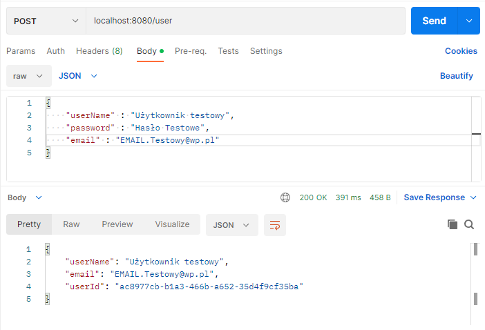
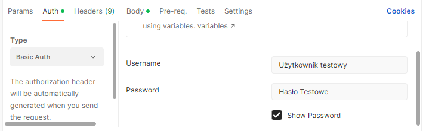

# Financial Controller:

The budget application is a Java-based REST API that allows users to manage their budgets. The application enables users to add, remove, and update budgets and expenses, as well as generate reports with data related to budgets and expenses for individual users.


# Requirements:

#### Java 17+

#### Docker

#### Postman

# Installation Instructions:
##### 1. Clone the application repository.
##### 2. Run the application in your development environment.
##### 3. Configure the application.yml file to match your environment.
##### 4. Open the docker-compose.yml file to create a Docker image.
##### 5. Start the application.


## Security:
##### To fully utilize the application, users need to create an account. To do so, they should send the appropriate HTTP request to the endpoint responsible for user registration. Here is an example:
#### Screenshot in Postman:

###   After creating a user, we can now fully utilize the application, ensuring that we provide the values as shown in the image below:


#### All endpoints:
##### Endpoint: POST localhost:8080/user <- User Registration
Here is an example request body:
```json
 {
"username": "rafal",
"password": "rafalek12345" <-(Minimum password length of 12 characters.)
"email": "janek123@example.com"
}
```
##### Endpoint: POST localhost:8080/budgets <-add budget
Here is an example request body:
```json
{
"title": "Budget",
"limit": "33",
"typeOfBudget :"HALF"
"maxSingleExpense" : "333"
}
```
##### Endpoint: GET localhost:8080/budgets <-Get all budget
##### Endpoint: GET localhost:8080/budgets/{id}/status <-Get budget status
##### Endpoint: GET localhost:8080/budgets/{id} <-get budget by id
##### Endpoint: PUT localhost:8080/budgets/{id}<- update budget by id
Here is an example request body:
```json
{
"title": "My new Budget",
"limit": "34",
"typeOfBudget :"HALF",
"maxSingleExpense" : "334"
}
```
##### Endpoint: DELETE localhost:8080/budgets/{id} <-Delete budget

##### Endpoint: POST localhost:8080/expenses <-Add budget
Here is an example request body:
```json
{
  "title" : " Title",
  "amount" : "34",
  "budgetId": "bccd93bb-6a0a-478a-9af5-235bc03f5935"
}
```
##### Endpoint: GET localhost:8080/expenses <-Get All expenses:
##### Endpoint: GET localhost:8080/expenses/{id}<-Get expense by id
##### Endpoint: PUT localhost:8080/expenses/{id} <-update expense by id
Here is an example request body:
```json
{ 
  "title" : "update Title",
    "amount" : "35",
    "budgetId": "bccd93bb-6a0a-478a-9af5-235bc03f5935"
}
```
##### Endpoint: DELETE /expenses/{id} <-Delete expense
